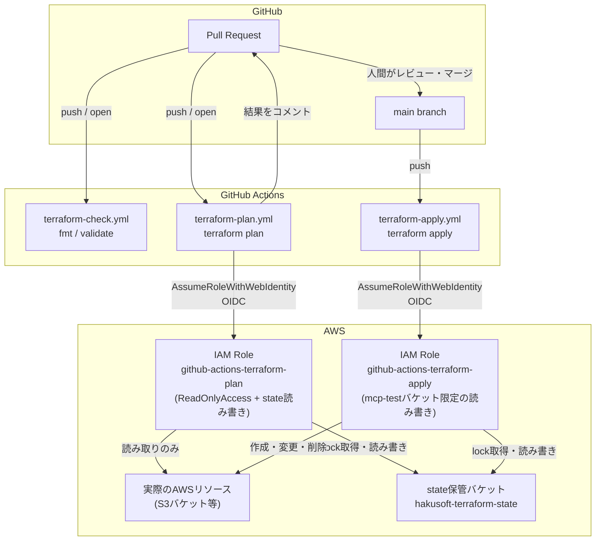
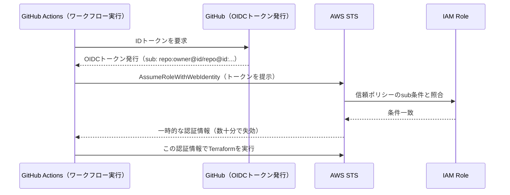

# hakusoft-infra

Infrastructure as Code (Terraform) for hakusoft projects.

モノレポ構成。サービスごとにディレクトリを分け、まずは `mcp-test/` から着手している。

## ディレクトリ構成

```
hakusoft-infra/
└── mcp-test/          # mcp-test リポジトリ向けのAWSリソース定義
    ├── providers.tf   # AWSプロバイダー・S3リモートバックエンドの宣言
    ├── main.tf        # 実際のリソース定義
    └── .terraform.lock.hcl
```

## CI/CDの全体像

PRでの `plan`（読み取り専用の予告確認）と、`main`マージ後の `apply`（実際の反映）を、
権限の異なる別々のIAM Roleで分離している。



## なぜ2つのIAM Roleに分けているか

`terraform plan` は本来読み取り専用の操作、`terraform apply` は実際にリソースを
変更する操作。この二つに同じ強い権限（例: `AdministratorAccess`）を使い回すと、
「PRを開いただけ」で本番相当の権限を持つ処理が走ることになり、リスクが不必要に
大きくなる。そのため権限も、Assumeできる条件（後述）も、あえて別のRoleに分離している。

| Role | 使用箇所 | 権限 | Assume可能な条件 |
|---|---|---|---|
| `github-actions-terraform-plan` | PR時の`plan` | `ReadOnlyAccess` + stateバケットの読み書き | このリポジトリの全イベント |
| `github-actions-terraform-apply` | `main`マージ後の`apply` | 対象S3バケットの作成・変更・削除 + stateバケットの読み書き | `main`ブランチへのpushのみ |

## OIDC認証の仕組み

長期のAWSアクセスキーをGitHub Secretsに保存する代わりに、GitHub ActionsとAWSの
信頼関係（OIDC）を使い、実行のたびにその場限りの一時認証情報を発行してもらう。



**信頼ポリシーの`sub`条件がGitHub側の実際の値と一致しないと、ここで認証が拒否される。**
GitHubの「Immutable Subject」という仕様により、`sub`は`repo:owner/repo:...`という
単純な形式ではなく、`repo:owner@ユーザーID/repo@リポジトリID:...`というID付きの
形式になる。信頼ポリシーを書く際は、決め打ちせず一度実際の値をログで確認するのが安全。

## 運用ルール

- `main`への直接pushは禁止（ブランチ保護でPR経由のみ許可）
- Issueを起点に、ブランチ作成 → 実装 → PR → CI確認 → セルフレビュー → 人間のレビュー・マージ、という流れで統一する（`mcp-test`リポジトリと同じ型）
- `apply`の自動実行は`main`マージ後のみ。PRの時点では`plan`（読み取り専用の予告）までしか行わない
