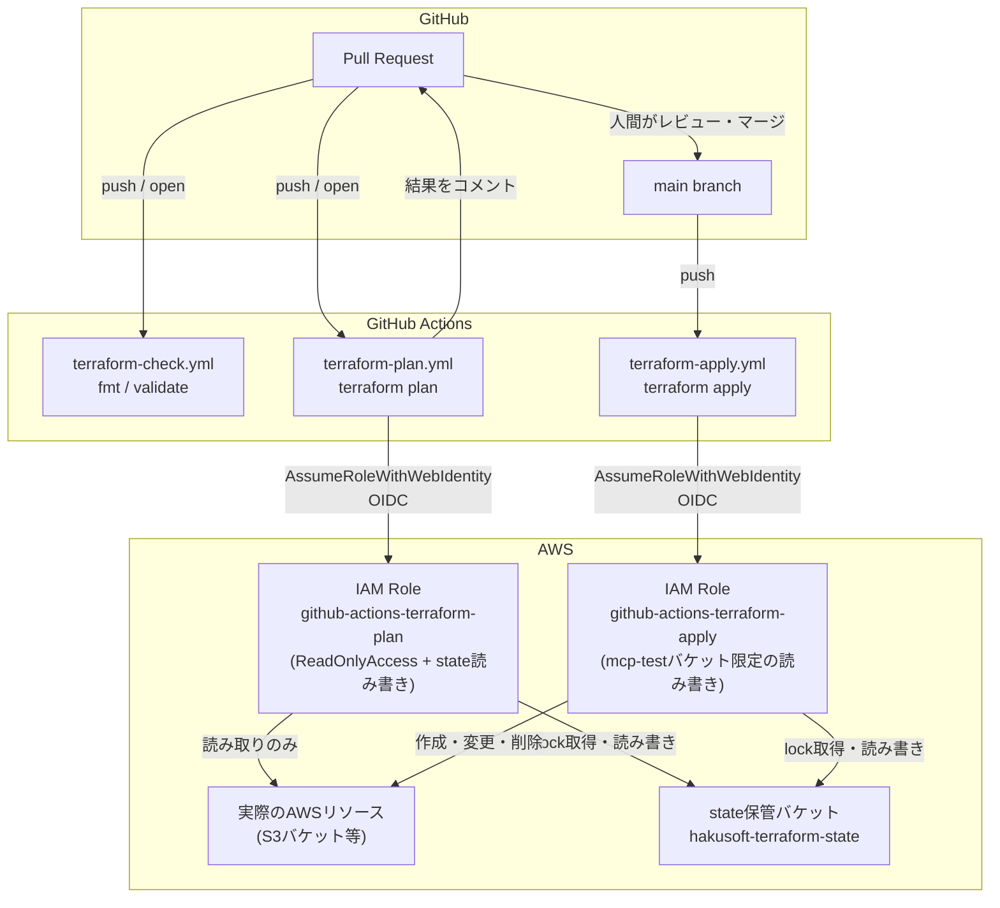
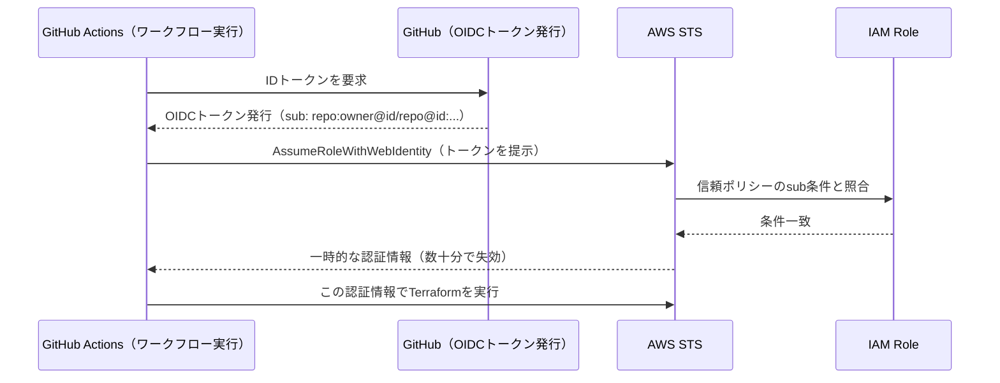

# mcp-test インフラ

[mcp-test](https://github.com/hakusoft/mcp-test) 向けのサンドボックス。
Terraform の `init → plan → apply → destroy` と、CI から OIDC で AWS を触る
仕組みを検証するための場所で、**このリポジトリの CI が対象にしているのはここだけ**。

## リソース構成

| ファイル | 内容 |
| --- | --- |
| `providers.tf` | AWS プロバイダー・S3 リモートバックエンドの宣言 |
| `main.tf` | 検証用 S3 バケット 1 本 |

## CI/CD の全体像

PR での `plan`（読み取り専用の予告確認）と、`main` マージ後の `apply`（実際の反映）を、
権限の異なる別々の IAM Role で分離している。

## なぜ 2 つの IAM Role に分けているか

`terraform plan` は本来読み取り専用の操作、`terraform apply` は実際にリソースを
変更する操作。この二つに同じ強い権限（例: `AdministratorAccess`）を使い回すと、
「PR を開いただけ」で本番相当の権限を持つ処理が走ることになり、リスクが不必要に
大きくなる。そのため権限も、Assume できる条件も、あえて別の Role に分離している。

| Role | 使用箇所 | 権限 | Assume 可能な条件 |
| --- | --- | --- | --- |
| `github-actions-terraform-plan` | PR 時の `plan` | `ReadOnlyAccess` + state バケットの読み書き | このリポジトリの全イベント |
| `github-actions-terraform-apply` | `main` マージ後の `apply` | 対象 S3 バケットの作成・変更・削除 + state バケットの読み書き | `main` ブランチへの push のみ |

## OIDC 認証の仕組み

長期の AWS アクセスキーを GitHub Secrets に保存する代わりに、GitHub Actions と AWS の
信頼関係（OIDC）を使い、実行のたびにその場限りの一時認証情報を発行してもらう。

**信頼ポリシーの `sub` 条件が GitHub 側の実際の値と一致しないと、ここで認証が拒否される。**
GitHub の「Immutable Subject」という仕様により、`sub` は `repo:owner/repo:...` という
単純な形式ではなく、`repo:owner@ユーザーID/repo@リポジトリID:...` という ID 付きの
形式になる。信頼ポリシーを書く際は、決め打ちせず一度実際の値をログで確認するのが安全。
