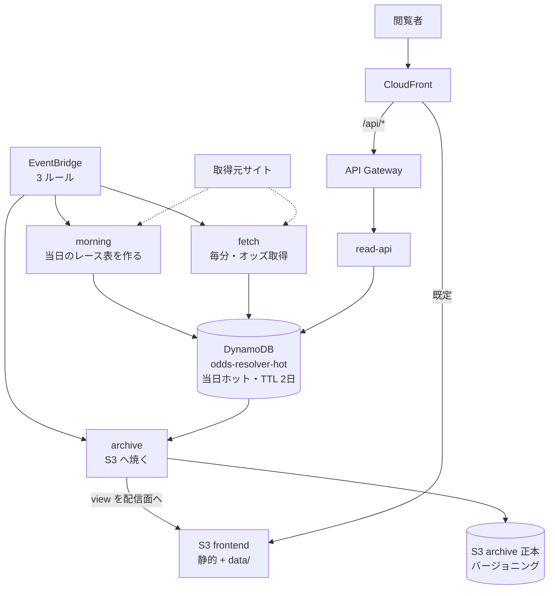
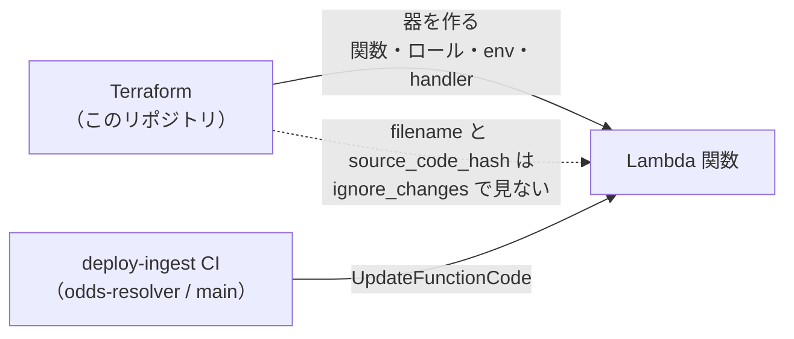

# odds-resolver インフラ

[odds-resolver](https://github.com/hakusoft/odds-resolver)（競馬オッズ可視化サイト）の
AWS リソース定義。アプリの全体像はアプリ側 README を、ここではリソースと運用の事実を書く。

## 構成図

閲覧者は CloudFront 一枚だけを見る。静的ファイルは S3、`/api/*` だけが Lambda へ抜ける。
データは「当日＝DynamoDB」「過去＝S3」に分かれ、夜間の archive がその境界を移動させる。



## リソース構成

| ファイル | 内容 |
| --- | --- |
| `ingest.tf` | DynamoDB（当日ホット）・Lambda 4 関数・EventBridge 3 ルール・読み取り API（API Gateway） |
| `frontend.tf` | 配信用 S3 バケット・CloudFront（既定=S3 / `/api/*`=API Gateway） |
| `data.tf` | アーカイブ正本の S3 バケット（バージョニング・非現行版 30 日失効） |
| `oidc.tf` | GitHub Actions 用デプロイロール 2 本（OIDC） |

## DynamoDB 単一テーブル（odds-resolver-hot）

必要な問いを全てキー直撃にする。

| 問い | クエリ |
| --- | --- |
| 当日の全レース表 | `Query PK=DAY#{YYYYMMDD}` |
| あるレースの時系列 | `Query PK=RACE#{race_id}` |
| 最新スナップショット | 同上を降順 Limit 1 |

- provisioned 10/10 RCU/WCU（常設無料枠内に固定）
- `expires_at` による TTL（2 日）。夜間バッチで S3 へ焼いた後は自動失効し、削除コードを書かない

## ジョブの時系列（すべて JST。cron は UTC 表記）

```
23:30 ──→ archive   当日の確定分を S3 へ焼く（昨日までの世界を確定させる）
00:00     （日付切替。フロントは新しい日付を「当日」として API に問い始める）
00:15 ──→ morning   当日のレース表を取得し DynamoDB に器を作る
00:16〜   fetch     毎分起動。朝の窓では前日の着順を回収し、発売開始
                    （10:00）以降はスロット駆動で最も切迫した 1 レースを取得
02:30 ──→ archive   回収した前日の着順を view へ再焼き（mode=yesterday）
```

| JST | ルール | cron/rate | 関数 |
| --- | --- | --- | --- |
| 23:30 | archive-nightly | `cron(30 14 * * ? *)` | archive |
| 0:15 | morning-daily | `cron(15 15 * * ? *)` | morning |
| 2:30 | archive-rebake | `cron(30 17 * * ? *)`・input `{"mode":"yesterday"}` | archive |
| 毎分 | fetch-minutely | `rate(1 minute)` | fetch |
| リクエスト駆動 | ―（CloudFront `/api/*` → API Gateway） | ― | read-api |

順序の理由:

- **archive が日付切替より前**: 切替直後にフロントが昨日を S3 で読みに行くため、
  先に焼き終えて空白を作らない
- **morning が 0:15**: 0:00 ちょうどは取得元の日次切替と重なりうるためずらす
- **fetch は器がなければ空振りするだけ**なので順序に敏感でない

## Lambda コードの契約

Terraform は器（関数・ロール・環境変数・handler）だけを管理し、コードは
`ignore_changes = [filename, source_code_hash]` で見ない。実コードは
odds-resolver リポジトリの deploy-ingest CI（main マージ時）が
`update-function-code` で 4 関数へ配る。



- 新設時はプレースホルダ zip で作られ、CI の初回デプロイで実コードに置き換わる
- **handler の切替は Terraform 側の変更**（実装が載る PR とセットで行う）

## IAM ロール分離

| ロール | 使い手 | 権限 |
| --- | --- | --- |
| odds-resolver-github-deploy | deploy.yml（frontend） | frontend バケット同期・data バケット追記・CloudFront 無効化 |
| odds-resolver-github-deploy-ingest | deploy-ingest.yml | 4 関数への UpdateFunctionCode のみ |
| odds-resolver-ingest-lambda | morning / fetch | DynamoDB PutItem・Query |
| odds-resolver-archive-lambda | archive | DynamoDB Query・data バケット書き（+days.json 読み）・frontend バケット data/ 書き |
| odds-resolver-read-api-lambda | read-api | DynamoDB Query |

CI 用 2 本を分けるのは、どちらかの workflow が侵害されたときの被害を
「フロント配信物」か「Lambda コード」の片側に閉じるため。信頼ポリシーは
どちらも odds-resolver リポジトリの main ブランチのみ。

## 運用

- **このディレクトリは手元 `terraform apply`**。リポジトリ CI の plan / apply は
  mcp-test ディレクトリのみを対象にしている（拡張は #15）
- マージ前の main 以外からの apply は、適用済みの変更を巻き戻しうるので避ける
  （PR を先にマージ → clean な main から apply）。`-target` は依存リソースを
  巻き込むため原則使わない
- 取得元の詳細（サイト名・URL）はこのリポジトリにも書かない（アプリ側と同じ方針）
